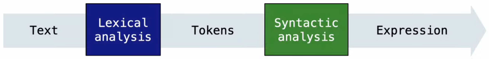
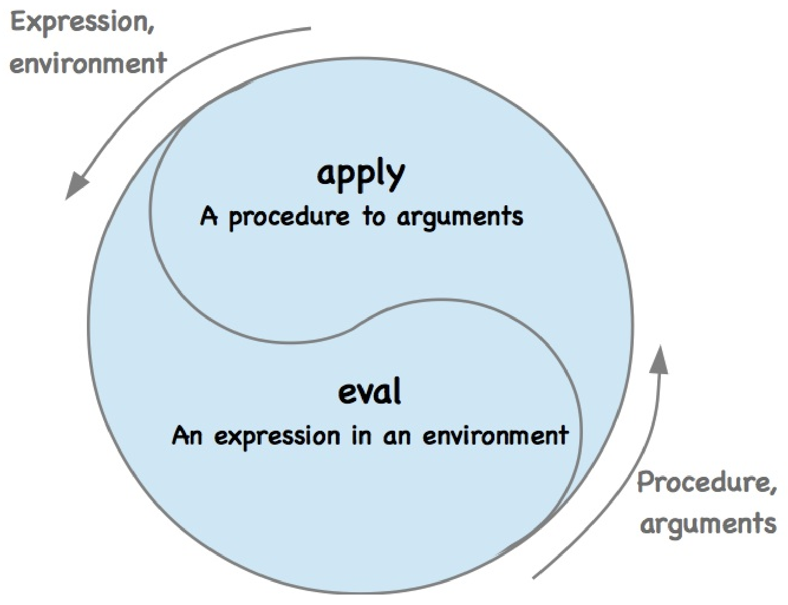

<!--
 * @Descripttion: 
 * @Version: 1.0
 * @Author: ZhangHongYu
 * @Date: 2022-07-04 17:31:00
 * @LastEditors: ZhangHongYu
 * @LastEditTime: 2022-07-07 15:14:04
-->
<p align="center">

</p>

<div align="center">

# TinyPy: Python实现的迷你Python解释器

[](https://github.com/orion-orion/TinyPy)[](https://github.com/orion-orion/TinyPy)[](https://github.com/orion-orion/TinyPy)
<br/>
[](https://github.com/orion-orion/TinyPy) [](https://github.com/orion-orion/TinyPy)
</div>

## 1 简介

[TinyPy](https://github.com/orion-orion/TinyPy)是一个Python实现的迷你Python解释器, 主要参考了巫师书（the Wizard Book）[《SICP》](https://web.mit.edu/6.001/6.037/sicp.pdf)和UC Berkeley的同名课程[CS 61A](https://inst.eecs.berkeley.edu/~cs61a/sp21/)。目前只支持Python算术表达式和 $\lambda$ 表达式的求值，后续会逐步添加更多功能。 

该解释器按照**读入-求值-打印循环（read-eval-print loop, REPL）** 模式运作。其中读入部分包括了包括**词法分析（lexical analysis）**和**语法分析（syntactic analysis）** 两个流程，如下图所示：

<p align="center">

</p>

词法分析模块线性扫描用户输入的字符串并将其转换为tokens流，语法分析模块则对tokens流进行递归下降的解析并将其转换为抽象语法树（abstract syntax tree, AST）。

**表达式求值（expression evaluation）** 部分的本质则是一个如下图所示的eval-apply循环：

<p align="center">

</p>

其中eval部分负责在给定环境（environment）下对表达式求值，apply部分负责将过程应用于实参（arguments）。在具体实现上，环境即是一张存储有变量与其值绑定（bindings）的表，eval会在给定环境下对组合式的运算符（operator）和运算对象（operand）部分进行递归地求值。而apply会先将实参绑定到过程的形参（parameters），然后在所得到的新环境下对过程进行求值。

>在**元语言抽象（metalinguistic abstraction）** 的模型下，数据和程序本无分别，它们就如同咬住自己尾巴的衔尾蛇，可以互相转换，生生不息。我们将程序看做是一种抽象的（可能无穷大的）机器的一个表述，那么解释器就可以看做是一部非常特殊的机器，它要求以一部机器的描述作为输入，并模拟被描述机器的执行过程。按照这一观点，任一解释器都能模拟其它的解释器。

## 2 环境依赖

我本地的Python版本为3.9.13。

## 3 使用方法

### 3.1 打印表达式求值结果

运行`tinypy.py`可进入REPL循环:

```bash
$ python tinypy.py
>>> 
```

下面是算术表达式的求值结果：

```python
>>> add(2, 3)
5
>>> truediv(abs(sub(2, 5)), 2)
1.5
>>> max(mod(5, 3), mod(5, 2), mod(5, 1))
2
```

下面是 $\lambda$ 表达式的求值结果：

```python
>>> (lambda: 2)()
2
>>> (lambda x, y: add(y, x))(2, 3)
5
>>> (lambda x: add(x, 2))(3)
5
>>> (lambda f: f(0))(lambda x: pow(2, x))
1
```

下面展示的这个例子非常有趣，它是柯里化（currying）的一个例子，也即把接受多个参数的函数变换成接受一个单一参数的函数，并且返回接受余下的参数而且返回结果的新函数的技术。

```python
>>> (lambda x: lambda y: add(x, y))(2)(3)
5
```

接下来让我们形式化地看上面的例子。函数 $f(x, y)= x + y$ 可以写作 $\lambda x.\lambda y. x + y$ ，上面的例子成立实际上是由于下面三个表达式的等价性：

$$
(\lambda x . \lambda y . x+y) \space 2\space 3=(\lambda y .2+y) \space 3 = 2+3
$$

## 3.2 打印表达式的抽象语法树

要想打印表达式的抽象语法树，在运行时`tinypy.py`时添加`--ast`选项声明即可：

```python
$ python tinypy.py --ast
>>> add(2, 3)
Application(Variable('add'), [Literal(2), Literal(3)])
>>> (lambda: 2)()
Application(Lambda([], Literal(2)), [])
>>> (lambda x: add(x, 2))(3)
Application(Lambda(['x'], Application(Variable('add'),
[Variable('x'), Literal(2)])), [Literal(3)])
```
